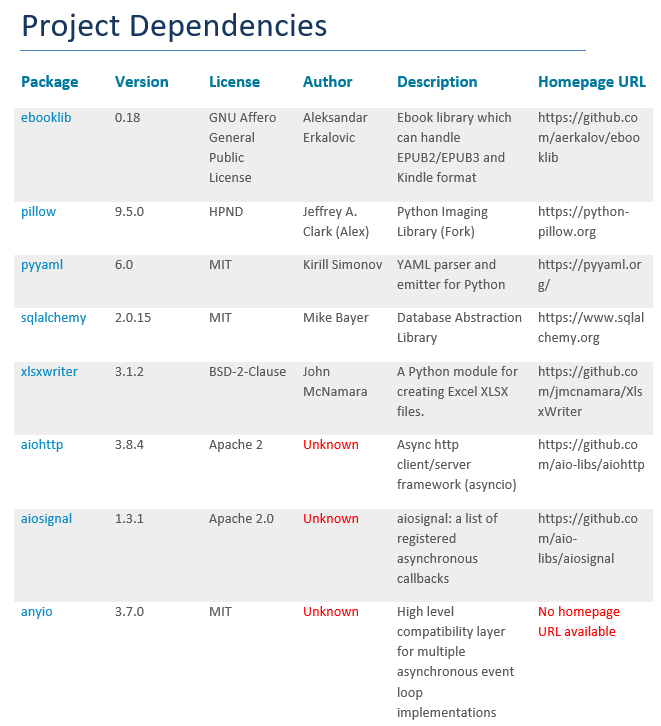

# Python Dependency Report Generator

It produces a `docx` format document which lists out all the dependencies that a certain python environments uses. For proper usage please the usage guides

## Usage

1. Make sure that your target virtual environment is already created and accessed, otherwise the report will be generated for the global environment.
2. place the `gen_docx.py` file in (preferably) your root directory of your project (or it could be any other directory for that matter)
3. install the dependency for this file which is just `python-docx`.
```
pip3 install python-docx
```
4. execute the `gen_docx.py` file using
```
python3 ./gen_docx.py 
```
5. and you will see a file named `dependencies_report.docx` created in the same directory. 

## Preview
The generated document will look something like this


## Further Development
- [ ] add setter methods for theme customizations
- [ ] add layout customizations
- [ ] convert it into a python package
